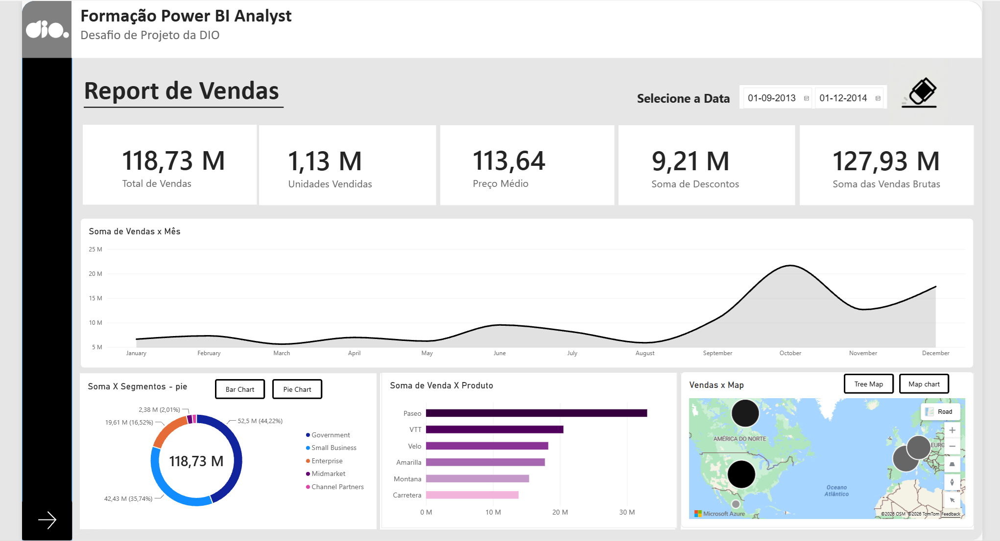

# 📊 Desafio de Projeto: Relatório de Vendas no Power BI - DIO

  

## 🎯 Sobre o Projeto
Este repositório contém a solução desenvolvida como parte do **desafio prático de Power BI da DIO**. O objetivo foi construir um relatório gerencial interativo de vendas, aplicando conceitos fundamentais de modelagem de dados, criação de medidas DAX e formatação visual.

---

## 🛠️ Tecnologias e Recursos Aplicados
* **Power BI Desktop**
* **Linguagem DAX** (Criação de medidas e indicadores de desempenho)
* **Painel de Seleção e Indicadores (Bookmarks):** Implementação de alternância dinâmica de gráficos (UI Toggle) no mesmo espaço do canvas.
* **Geolocalização:** Uso de mapas para análise de vendas regionais.
* **GitHub:** Publicação e versionamento do projeto prático.

---

## 💡 Principais Aprendizados e Desafios Superados
Durante o desenvolvimento guiado pelas aulas, foram aplicadas boas práticas de construção de dashboards, incluindo:
* Estruturação e organização de camadas visuais (*Z-Order*) para evitar sobreposições indesejadas.
* Configuração correta de *Bookmarks* focando apenas na exibição (*Display*) para garantir uma alternância fluida entre os gráficos sem interferir nos filtros.

---

## 📷 Visualização do Dashboard
*(Insira aqui os prints do seu relatório finalizado para ilustrar o projeto)*

---

## 👨‍💻 Autor
Desenvolvido por **André Luiz** durante a trilha de Power BI da **DIO**.  
[GitHub](https://github.com/aluiz-91)
